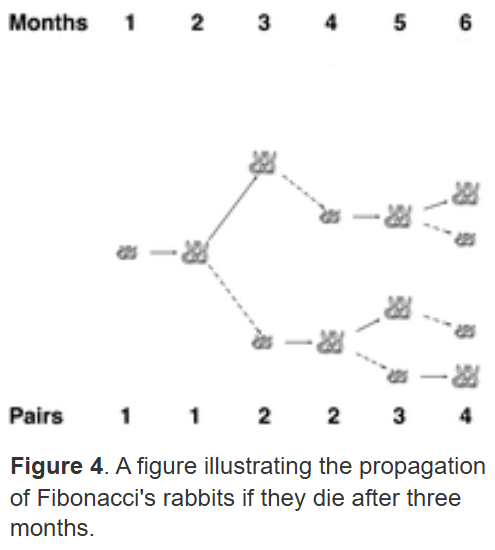

# 011_Mortal Fibonacci Rabbits 🐰🐰☠️
*rosalind id : FIBD
*너무 어려워요..

## 문제 이해

### 문제 설명
- 이전에 풀었던 "Rabbits and Recurrence Relations" (토끼 피보나치 수열) 문제의 확장판
- 기존의 피보나치 모델에서 토끼가 일정 개월(m개월) 후에 죽는 조건을 추가해야 함

**004_피보나치 토끼문제 복습**
- 한 쌍의 토끼는 2개월 후부터 매월 1쌍의 새끼를 낳음.
- 토끼는 절대 죽지 않음 → 계속 번식하면서 개체 수가 증가.
- 점화식 : Fn = F(n-1) + F(n-2) (단, n>m인 경우)
    - F(n-1): 이전 달까지 살아 있는 토끼 수 (모두 그대로 생존)
    - F(n-2): 두 달 전의 토끼들이 낳은 새끼들

**변경된 조건 : 토끼는 m개월 후에 죽는다**
- 이제 토끼가 일정 개월(m개월) 후에 죽는 조건이 추가됨.
- 즉, m개월이 지난 토끼는 개체 수에서 제거해야 함.
- 더 이상 단순한 피보나치 수열이 아니라 동적 계획법(DP)을 활용한 시뮬레이션이 필요.
- 새로운 점화식 : Fn = F(n-1) + F(n-2) - F(n-m-1)
    - F(n-1): 지난 달까지 살아 있던 모든 토끼 (그대로 유지됨)
    - F(n-2): 두 달 전에 태어난 토끼들이 낳은 새끼들 (새롭게 추가됨)
    - F(n-m-1): m개월 전에 태어난 토끼들은 이번 달에 죽음 (개체 수에서 제거)
    - 즉, 기존 피보나치 점화식에서 "죽은 토끼 수"를 빼주는 것이 핵심

### input, output
**input**
``
6 3
``
- n = 6 (6개월 후의 총 토끼 수를 구해야 함)
- m = 3 (각 토끼는 3개월 후에 죽음)
**output**
`
4
`
- 6개월 후 살아남은 토끼 쌍 수는 4쌍.
| 월(n) | 살아남은 토끼(F_n) | 새로 태어난 토끼 | 죽은 토끼 (m=3개월 후) |
|----|------|------------|------------|
| 1  | 1    | 0          | 0          |
| 2  | 1    | 0          | 0          |
| 3  | 2    | 1          | 0          |
| 4  | 3    | 1          | 0          |
| 5  | 4    | 1          | 1 (1개월째 토끼) |
| 6  | 4    | 1          | 1 (2개월째 토끼) |

- 코드 표
| 월(n) | `dp[n]` 값 | 설명 |
|----|--------|----------------------------|
| 1  | 1      | 첫 달에는 한 쌍의 토끼만 존재 (`dp[1] = 1`) |
| 2  | 1      | 둘째 달에도 한 쌍의 토끼만 존재 (`dp[2] = 1`) |
| 3  | 2      | 새끼가 한 쌍 태어남 (`dp[3] = 1 + 1 = 2`) |
| 4  | 3      | 한 쌍이 새끼를 낳음 (`dp[4] = 2 + 1 = 3`) |
| 5  | 4      | 새끼가 한 쌍 태어남 (`dp[5] = 3 + 1 = 4`) |
| 6  | 4      | 두 달 전에 태어난 토끼는 죽고, 새끼 한 쌍 태어남 (`dp[6] = 4 + 1 - 1 = 4`) |


## 파이썬 공부

### 리스트의 크기를 미리 할당하는 이유
- 효율적으로 사용하기 위해
- 각 월(n)의 토끼 개체 수를 저장할 공간을 미리 확보
- dp[i]를 반복문에서 값을 업데이트하면서 재사용 가능

### Dynamic Programming (DP, 동적 계획법)
- 큰 문제를 작은 문제로 나누어 푸는 최적화 기법
- 작은 문제의 해답을 저장하고, 이를 재사용하여 중복 계산을 줄이는 것이 핵심
- 문제를 작은 하위 문제들로 나누어 해결
- 점화식을 기반으로 해결
- 재귀 또는 반복문으로 구현 가능
- DP의 핵심 기법
    1. Top down : 재귀를 사용하여 큰 문제를 작은문제로 쪼개면서 해결, 이미 계산된 값은 저장
        - 구현방식 : 재귀 + dict 또는 리스트를 사용해 저장
    2. Bottom up : 작은 문제부터 차례로 해결하며 테이블을 채워나감
        - 구현방식 : 반복문을 사용하여 list에 값을 저장
**비효율적인 일반 재귀 예시**
```
def fib(n):
    if n <= 2:
        return 1
    return fib(n-1) + fib(n-2)  # 중복 계산 발생
```
fib(5)를 계산하려면 fib(4), fib(3)을 여러 번 반복 계산해야 함 → 비효율적!
**효율적인 Top-down 예시**
```
memo = {}  # 결과 저장 (해시 테이블)

def fib(n):
    if n in memo:
        return memo[n]  # 이미 계산된 값 반환
    if n <= 2:
        return 1
    memo[n] = fib(n-1) + fib(n-2)
    return memo[n]

print(fib(100))  # O(n) 시간 복잡도로 해결!
```
한 번 계산한 결과를 저장하므로 중복 계산 방지
**효율적인 Bottom-up 예시**
```
def fib(n):
    dp = [0] * (n + 1) 
    dp[1], dp[2] = 1, 1

    for i in range(3, n + 1):
        dp[i] = dp[i-1] + dp[i-2]  # 작은 문제부터 차례로 해결

    return dp[n]

print(fib(100))  # O(n)
```
반복문을 사용하여 작은 문제부터 해결하므로 효율적

### `for _ in range(n + 1)`에서 `_`의 의미
```
for _ in range(n + 1):
```
- _는 "변수를 사용하지 않겠다"는 의미
- 즉, 반복문을 돌리지만 변수 값을 따로 저장하지 않겠다는 뜻.
- 일반적으로 반복 횟수만 필요하고, 실제 반복 변수는 필요하지 않을 때 사용
**_없이 사용한 경우**
```
for i in range(5):
    print(i)
```
0  
1  
2  
3  
4  
→ i는 0-4까지 변하면서 출력됨
**_를 사용한 경우**
```
for _ in range(5):
    print("반복 실행!")
```
반복 실행!  
반복 실행!  
반복 실행!  
반복 실행!  
반복 실행!  
→ 5번 반복하기만 하면 된다.  

### 이중 리스트(2D리스트, 2차원 리스트)
- dp[1][0] 처럼 리스트를 [][]로 사용
```
dp = [[0] * m for _ in range(n + 1)]
```
- dp는 "n+1개의 리스트"를 가지고 있으며, 각 리스트 안에 "m개의 요소"가 있는 형태
**예시**
```
dp = [[0] * 3 for _ in range(7)]
```
생성된 리스트 구조
```
[
 [0, 0, 0],  # dp[0]
 [0, 0, 0],  # dp[1]
 [0, 0, 0],  # dp[2]
 [0, 0, 0],  # dp[3]
 [0, 0, 0],  # dp[4]
 [0, 0, 0],  # dp[5]
 [0, 0, 0]   # dp[6]
]
```
- dp[1][0] → 1개월 차에서 0개월 된 토끼 수
- dp[2][1] → 2개월 차에서 1개월 된 토끼 수
- dp[6][2] → 6개월 차에서 2개월 된 토끼 수


<br>
<br>
<br>

## 코드 프로세스 : mortal_rabbit(6, 3) 실행 과정
초기상태 (dp[1][0] = 1)   


### 1개월차 (i=1)
```
월 1: [1, 0, 0]  # 한 쌍의 새끼 토끼
```

### 2개월차 (i=2)
- `newborn = sum(dp[1][1:3]) = sum([0, 0]) = 0` (출산할 성체가 없음)
- `dp[2][1] = dp[1][0] = 1` (0개월 된 토끼가 1개월 차가 됨)
```
월 2: [0, 1, 0]  # 1개월 차 토끼가 됨
```
### 3개월차 (i=3)
- `newborn = sum(dp[2][1:3]) = sum([1, 0]) = 1` (1개월 된 토끼가 새끼를 낳음)
- `dp[3][1] = dp[2][0] = 0` (0개월 차 토끼가 1개월 됨)
- `dp[3][2] = dp[2][1] = 1` (1개월 차 토끼가 2개월 됨)
- `dp[3][0] = newborn = 1` (새로운 0개월 차 토끼 추가)
```
월 3: [1, 0, 1]  # 새끼 1쌍, 2개월 차 1쌍
```

### 4개월차 (i=4)
- `newborn = sum(dp[3][1:3]) = sum([0, 1]) = 1` (2개월 된 토끼가 새끼를 낳음)
- `dp[4][1] = dp[3][0] = 1` (0개월 차 토끼가 1개월 됨)
- `dp[4][2] = dp[3][1] = 0` (1개월 차 토끼가 2개월 됨)
- `dp[4][0] = newborn = 1` (새로운 0개월 차 토끼 추가)
```
월 4: [1, 1, 0]  # 새끼 1쌍, 1개월 차 1쌍
```
### 5개월차 (i=5)
- `newborn = sum(dp[4][1:3]) = sum([1, 0]) = 1` (1개월 된 토끼가 새끼를 낳음)
- `dp[5][1] = dp[4][0] = 1` (0개월 차 토끼가 1개월 됨)
- `dp[5][2] = dp[4][1] = 1` (1개월 차 토끼가 2개월 됨)
- `dp[5][0] = newborn = 1` (새로운 0개월 차 토끼 추가)
```
월 5: [1, 1, 1]  # 새끼 1쌍, 1개월 차 1쌍, 2개월 차 1쌍
```
### 6개월차 (i=6)
- `newborn = sum(dp[5][1:3]) = sum([1, 1]) = 2` (1개월, 2개월 된 토끼가 새끼를 낳음)
- `dp[6][1] = dp[5][0] = 1` (0개월 차 토끼가 1개월 됨)
- `dp[6][2] = dp[5][1] = 1` (1개월 차 토끼가 2개월 됨)
- `dp[6][0] = newborn = 2` (새로운 0개월 차 토끼 추가)
```
월 6: [2, 1, 1]  # 새끼 2쌍, 1개월 차 1쌍, 2개월 차 1쌍
```
### 최종 계산 (dp[6]의 합)
```
sum(dp[6]) = 2 + 1 + 1 = 4
```


<br>
<br>
<br>
<br>
## 실패한 기록
```
def mortal_rabbit(n, m) :
    dp = [0] * (n+1) #리스트를 미리 생성하고 0으로 초기화하는 과정
    dp[1] = 1 #첫 달에는 한 쌍의 토끼만 존재
    dp[2] = 1 #둘째 달에도 한 쌍의 토끼만 존재

    for i in range(3, n+1) : # 3개월 차부터 계산 시작
        dp[i] = dp[i-1] + dp[i-2]  # 기본적인 피보나치
        if i > m:  # m개월 후에 죽는 토끼는 제거
            dp[i] -= dp[i-m]  # 정확히 m개월 전에 태어난 토끼는 죽음
    return dp[n]


print(mortal_rabbit(6, 3))
```