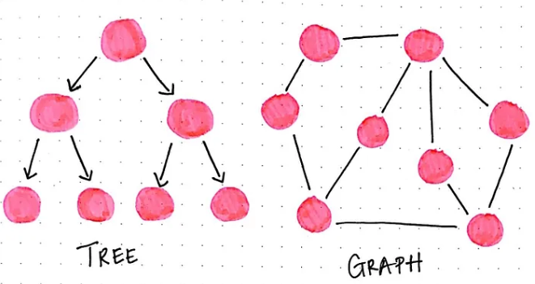

# 012_Overlap Graph
*rosalind id : GRPH

## 문제 이해
### 목표
- DNA 서열 모음이 주어졌을 때, 각 서열을 Node로 간주하고, 
- 특정 조건을 만족하는 경우에만 방향성 간선(Directed Edge)을 추가하여 
- Overlap Graph를 생성하는 것이 목표

### Graph Theory에 대한 소개

**그래프(Graph)**
- 네트워크를 나타내는 수학적 개념이다.
- 그래프는 두 가지 주요 구성 요소로 이루어진다:
    - 노드(Node) / 정점(Vertex): 네트워크의 중심점 역할을 하는 요소
    - 간선(Edge): 두 노드를 연결하는 선 (직선, 곡선 등)
- 예를 들어, 노드 v와 w를 연결하는 간선은 v,w (또는 w,v)로 표기한다.
**그래프 관련 용어 정리**
- 간선(Edge) v,w는 v와 w에 부착되어(incident) 있다.
- 두 노드 v와 w가 간선으로 연결되어 있다면, 이들은 "인접(Adjacent)"한 관계이다.
- 노드 v의 차수(Degree): v에 연결된 간선의 개수
- 워크(Walk): 연속된 간선들로 이루어진 경로
    - 예: {v1,v2}, {v2,v3}, {v3,v4}처럼 연결된 순서대로 나열된 간선들
- 경로(Path): 워크(Walk) 중에서 각 노드가 최대 두 개의 간선에서만 등장하는 경우
- 경로 길이(Path Length): 경로 내 포함된 간선의 개수
- 사이클(Cycle):경로 중 시작 노드와 끝 노드가 동일한 경우. 각 노드는 정확히 두 개의 간선과 연결됨
- 두 정점 간 거리(Distance): 두 정점을 연결하는 가장 짧은 경로의 길이(최소 간선 개수)
**그래프 이론(Graph Theory)란?**
- 그래프 이론은 그래프의 수학적 성질을 연구하는 학문이다.
- 그래프는 네트워크의 구조를 분석하고, 최단 경로를 찾거나, 연결성을 확인하는 데 활용된다.
- 즉, 네트워크의 수학적 모델을 다루는 학문이 그래프 이론!

### 그래프 표현 방식
- Graph는 여러 방식으로 표현할 수 있는데, 그중 하나가 인접 리스트(Adjacency List)이다.
- 인접 리스트(Adjacency List): 그래프의 노드를 나열하고, 각 노드가 연결된 다른 노드를 리스트 형태로 저장하는 방법이다.
- 예를 들어, 노드 A가 B와 C에 연결되어 있다면
```
A -> B
A -> C
```

### 방향성 그래프(Directed Graph, Digraph)
- 화살표 방향이 있는 그래프를 의미한다.
- 즉, v → w라는 간선이 있다면 w → v는 자동으로 포함되지 않음.
- (v, w)는 v에서 출발하여 w로 향하는 간선이다.
    - (v, w)는 존재해도 (w, v)는 자동으로 포함되지 않는다.
    - 즉, v → w는 존재할 수 있지만, w → v는 별도로 명시되지 않는 한 존재하지 않는다.
- 자기 자신으로 가는 간선(Directed Loop): (v, v)는 허용되지 않는다.

### 겹침 그래프 (Overlap Graph)
- 서열의 접합 관계를 표현하는 방향성 그래프이다.
- 각 DNA 서열을 그래프의 노드(Node)로 표현
- 각 노드(서열) 간 간선(Edge)을 추가하는 조건:
    - 서열 s의 마지막 k개의 염기서열이
    - 서열 t의 처음 k개의 염기서열과 같다면
    - 방향성 간선 (s → t)를 추가
    - 단, s ≠ t 여야 한다. (즉, 자기 자신으로 가는 간선은 허용되지 않음)
- 문제에서는 k=3으로 주어졌으므로, 각 DNA 서열의 마지막 3개 염기서열이 다른 DNA 서열의 처음 3개 염기서열과 일치하면 간선을 추가해야 한다.

### input, output
**input**
- fasta 형식의 DNA 서열 (총 길이는 최대 10000bp)
```
>Rosalind_0498
AAATAAA
>Rosalind_2391
AAATTTT
>Rosalind_2323
TTTTCCC
>Rosalind_0442
AAATCCC
>Rosalind_5013
GGGTGGG
```
**output**
- 오버랩 조건(k=3)을 만족하는 노드 간 연결을 인접 리스트 형식으로 출력
- 예제 입력의 경우, 아래와 같은 간선이 생성된다:
```
Rosalind_0498 → Rosalind_2391  (AAATAAA의 마지막 3글자 "AAA" == "AAA" AAATTTT의 처음 3글자)
Rosalind_0498 → Rosalind_0442  (AAATAAA의 마지막 3글자 "AAA" == "AAA" AAATCCC의 처음 3글자)
Rosalind_2391 → Rosalind_2323  (AAATTTT의 마지막 3글자 "TTT" == "TTT" TTTTCCC의 처음 3글자)
```
```
Rosalind_0498 Rosalind_2391
Rosalind_0498 Rosalind_0442
Rosalind_2391 Rosalind_2323
```
### 힌트
- FASTA 형식의 데이터를 읽어서 ID와 서열을 저장
- 각 서열에 대해 마지막 3개 염기서열을 추출
- 모든 서열과 비교하면서 다른 서열의 처음 3개 염기서열과 일치하는지 확인
- 일치하면 방향성 간선(s → t)을 인접 리스트 형식으로 출력

## 코드
###  print(edge[0], edge[1])의 의미
```
for edge in overlap_graph:
    print(edge[0], edge[1])  # 시작 노드와 끝 노드 출력
```
- edge[0]: 엣지의 출발 노드 (ID)
- edge[1]: 엣지의 도착 노드 (ID)
- 이렇게 하면 "ID1 ID2" 형태로 출력된다.

